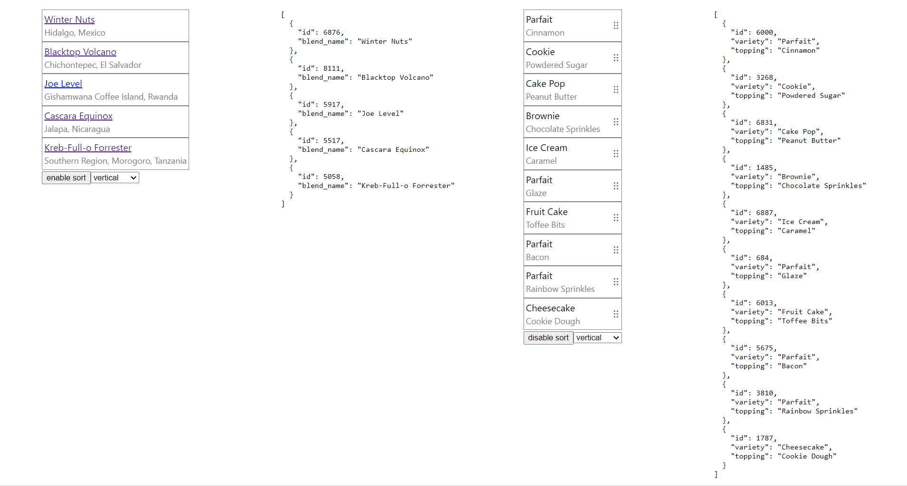

## React sortable drag test using [https://github.com/clauderic/dnd-kit](https://github.com/clauderic/dnd-kit)

In the project directory, you can run:

### `npm install`
### `npm start`

Runs the app in the development mode.\
Open [http://localhost:3000](http://localhost:3000) to view it in the browser.